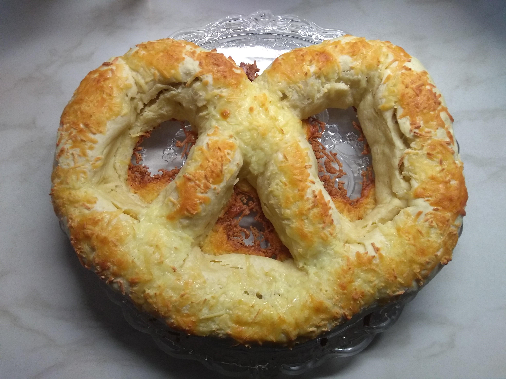

# Weißwurst Brezel

## Zutaten

* 500g Mehl
* 50g Butter
* 350ml Milch
* 1 Päckchen Hefe
* 9 Weißwürste
* 1 Packung geriebener Mozzarella

## Zubereitung

1. Das Mehl, die Hefe, die geschmolzene Butter und die Milch in eine Schale geben
2. Mit einem Schneebesen gut verrühren und zu einem Teig kneten
3. Kurz gehen lassen
4. Ofen auf 180°C vorheizen
5. Auf ausgestreutem Mehl aus dem Teig eine lange Wurst rollen
6. Aus der Teigwurst eine Brezel legen
7. Die Teigbrezel platt drücken
8. Die Weißwürste von ihrer Haut befreien
9. Optional: Käse auf den platten Teig streuen und leicht andrücken
10. Die Weißwürste auf dem Teig als Brezel anordnen
11. Den Teig um die Weißwürste (und den Käse) schließen
12. Den geschlossenen Teig auf der Oberseite leicht platt drücken
13. Den Mozzarella großzügig auf die platte Oberseite auflegen und leicht andrücken
14. Die Brezel im Ofen 30 Minuten backen. Bis der Käse goldbraun ist.
15. Optional: Mit Petersilie bestreuen

Zusammen mit süßem Senf servieren.